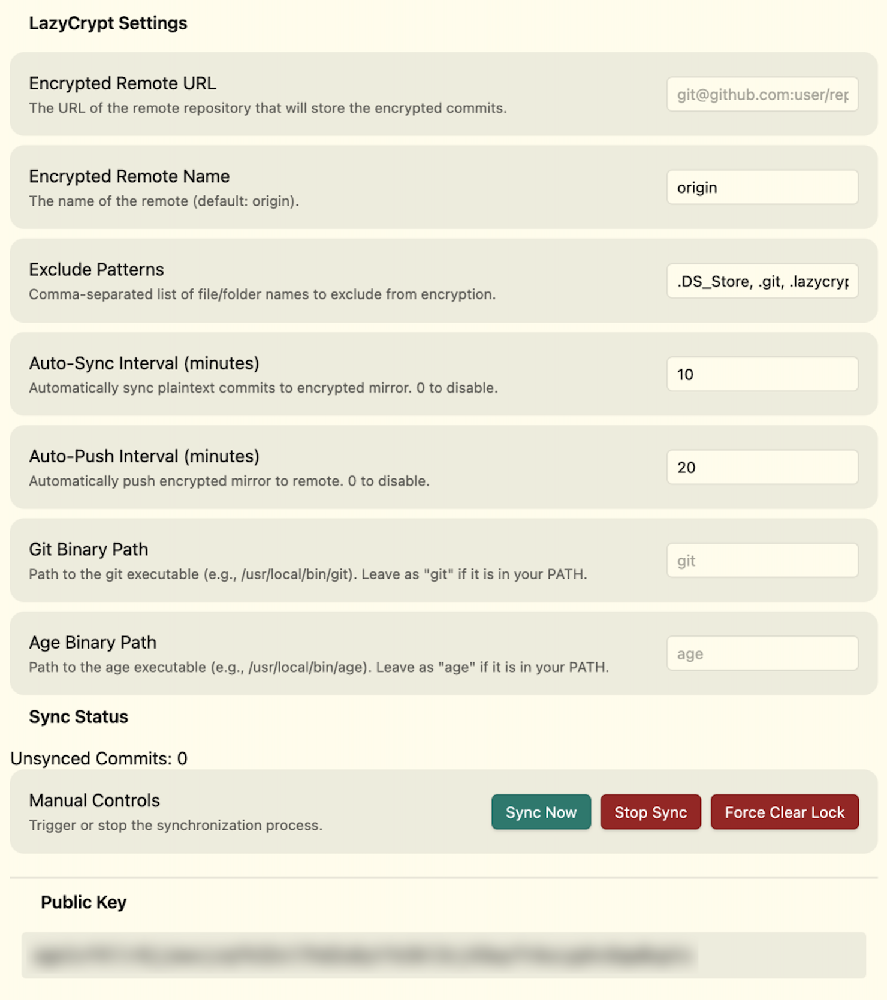

# LazyCrypt - Obsidian Plugin

Maintain an encrypted git history of your Obsidian vault using [age](https://age-encryption.org/) encryption.



[LazyCrypt](https://github.com/francois-marie/lazycrypt) mirrors every git commit in your vault into a separate *encrypted* repository. Each file is encrypted with your age public key before being committed to the encrypted mirror, which can then be pushed to a remote (e.g., GitHub) for secure off-site backup.

## Features

- **Encrypted git mirror**: Every plaintext commit is re-committed with all files encrypted via age.
- **Push to remote**: Push the encrypted mirror to any git remote for secure backup.
- **Pull and decrypt**: Recover your vault by pulling the encrypted history and decrypting it locally.
- **Auto-sync and auto-push**: Configurable intervals to automate encryption and pushing.
- **Progress tracking**: Status bar and notices show sync progress in real time.
- **Lock management**: Built-in lock file prevents concurrent syncs; force-clear available if stuck.

## Requirements

- **Desktop only** (macOS, Linux, Windows). This plugin uses Node.js APIs and is not compatible with Obsidian mobile.
- **git** must be installed and accessible.
- **age** (and `age-keygen`) must be installed and accessible. Install via Homebrew: `brew install age`.
- Your vault must be a git repository with at least one commit.

## Installation

### From community plugins

1. Open **Settings -> Community plugins**.
2. Search for "LazyCrypt" and select **Install**.
3. Enable the plugin.

### Manual installation

1. Download `main.js`, `manifest.json`, and `styles.css` from the [latest release](https://github.com/francois-marie/obsidian-lazycrypt-plugin/releases).
2. Copy them to `<your-vault>/.obsidian/plugins/obsidian-lazycrypt-plugin/`.
3. Reload Obsidian and enable the plugin in **Settings -> Community plugins**.

## Getting started

1. **Initialize**: Run the command **LazyCrypt: Initialize repository** from the command palette. This creates the `.lazycrypt/` directory, generates an age key pair, and sets up the encrypted bare repository.
2. **Configure remote**: Open **Settings -> LazyCrypt** and set the **Encrypted remote URL** to your target git remote (e.g., `git@github.com:user/vault-encrypted.git`).
3. **Sync**: Run **LazyCrypt: Sync encrypted history** or click the lock icon in the ribbon. This encrypts all unsynced commits.
4. **Push**: Run **LazyCrypt: Push encrypted history** to push the encrypted mirror to your remote.

## Commands

| Command | Description |
|---------|-------------|
| **Sync encrypted history** | Encrypt all new plaintext commits into the encrypted mirror |
| **Push encrypted history** | Push the encrypted mirror to the configured remote |
| **Initialize repository** | Set up the `.lazycrypt/` directory, keys, and encrypted repo |
| **Pull and decrypt history** | Pull from the encrypted remote and decrypt into the vault |

## Settings

| Setting | Description | Default |
|---------|-------------|---------|
| Encrypted remote URL | Git remote URL for the encrypted mirror | (empty) |
| Encrypted remote name | Name of the git remote | `origin` |
| Exclude patterns | Comma-separated patterns to exclude from encryption | `.DS_Store, .git, .lazycrypt` |
| Auto-sync interval | Minutes between automatic syncs (0 to disable) | `0` |
| Auto-push interval | Minutes between automatic pushes (0 to disable) | `0` |
| Git binary path | Path to the `git` executable | `git` |
| Age binary path | Path to the `age` executable | `age` |

## Recovery

To recover your vault from the encrypted backup:

1. Create a new vault (or use an empty directory as a git repo).
2. Install and enable LazyCrypt.
3. Copy your `.lazycrypt/` directory (containing your `keys/current.key`) into the vault root.
4. Configure the encrypted remote URL in settings.
5. Run **LazyCrypt: Pull and decrypt history**.

## Security

- All encryption is performed locally using age. No data is sent to any third-party service.
- Your private key (`keys/current.key`) never leaves your machine unless you copy it manually.
- The encrypted remote only ever receives age-encrypted blobs.
- **Back up your private key** (`<vault>/.lazycrypt/keys/current.key`). Without it, the encrypted history cannot be decrypted.

## Development

```bash
# Install dependencies
npm install

# Development build (watch mode)
npm run dev

# Production build
npm run build

# Lint
npm run lint
```

## License

[MIT](LICENSE)
